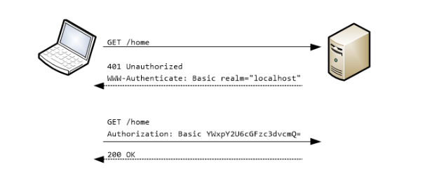

## Basic Authentication

- http header를 사용하는 인증 방ㅂ버 중 하나
- <usernmae>:<password> 로 이루어진 문자열을 base64로 인코딩 후 Authorication header에 실어서 서버에 전송

- DelegatingPasswordEncoder : 자체 인코딩 알고리즘을 구현하는 대신 같은 계약의 다른 구현 인스턴스에 작업을 위임한다. 해시는 해당 해시를 의미하는 알고리즘의 이름을 나타내는 접두사로 시작한다.
- PasswordEncoderFactories.createDelegatingPasswordEncode() : bcrypt가 기본 인코더이고 DelegatingPasswordEncoder의 구현을 반환하는 정적 메서드

## 스프링 시큐리티에서 인증 흐름을 위한 주 계약을 나타네는 인터페이스
- UserDetails : 스프링 시큐리티가 관리하는 사용자를 나타낸다.
- GrantedAuthority : 애플리케이션의 목적 내에서 사용자에게 허용되는 작업을 정의한다.
- UserDetailsService : 사용자 이름으로 사용자 세부 정보를 검색하는 객체를 나타낸다.
- UserDetailsManager : UserDetailsService의 더 구체적인 계약이다. 사용자 이름으로 사용자를 검색하는 것 외에도 사용자 컬렉션이나 특정 사용자를 변경할 수도 있다.
- PasswordEncode : 암호를 암호화 또는 해시하는 방법과 주어진 인코딩된 문자열을 일반 테스트 암호와 비교하는 방법을 지정한다.